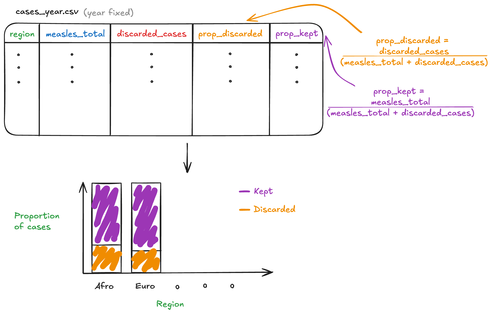
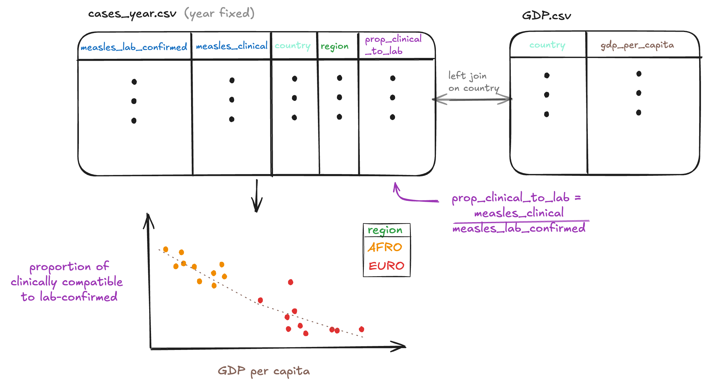

## Data Context

The measles data presents suspected and confirmed classification of measles and rubella cases across regions and countries in the world. There are two datasets, one of monthly case counts **cases_month,** and another of yearly summaries **cases_year**. The data was collected and sourced by the World Health Organization's provisional measles and rubella data, downloaded on June 12, 2025. Provisional data means that case counts aren't finalized and here they're usually reported as final by July every year.

## Data Cleaning

The cleaning script renamed variables to more descriptive names (like renaming **na**, **na_2**, ... to **measles_lab_confirmed**, **measles_epi_linked**, ...) and converted certain columns to numeric types. For cases_year, column names were moved from a row below the headers to be the header and remove a duplicate header row.

## Research questions

1.  What proportion of suspected measles cases are discarded, and does this vary by region (in a single year)?
2.  Do Epidemiologically-linked cases make more of total confirmed cases compared to clinically-compatible cases, and does this differ between measles and rubella?

## Research questions using supplemental data

3.  Are countries with lower vaccination rates associated with higher measles incidence rates per million population?
4.  Do countries with lower GDP or weaker healthcare access have a higher proportion of clinically-compatible cases relative to lab-confirmed cases, meaning possibly limited diagnostic capacity?

## Sketches

#### Sketch Question 1

{width="812"}

#### Sketch Question 4

{width="893"}

## Github

<https://github.com/HaileyErnest/project1>
